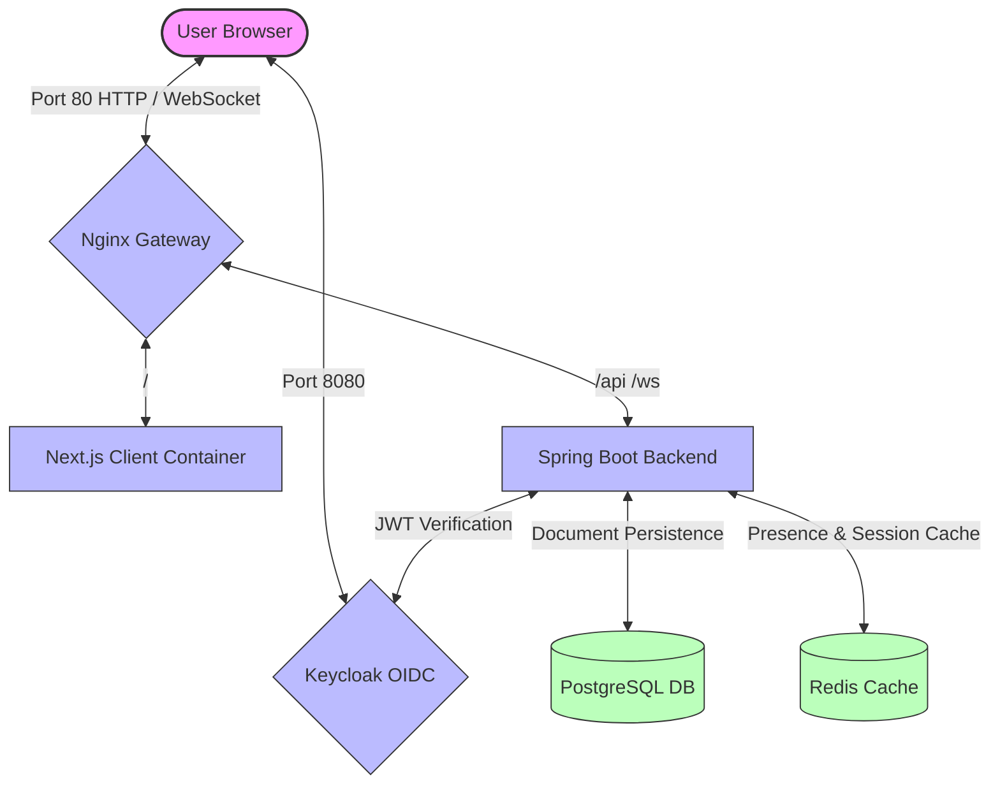

# 📝 Real-Time Collaborative Document Editor

A Google Docs clone with real-time editing. Everything runs in Docker containers using a Next.js frontend, Spring Boot backend replicas, Keycloak for auth, Redis for live presence/websockets, and PostgreSQL to save your documents.

---

## 🌟 What it does

*   **Real-Time Editing:** Multiple users can write in the same document at the same time. No merge conflicts, powered by **Y.js (CRDT)**.
*   **Live Presence:** See who is currently editing in real-time. Displays friendly usernames (like `abc` or `kasia`) parsed directly from JWT tokens, with deduplication so you don't see double names if you open multiple tabs.
*   **Simple Dashboard:** View your own documents and the ones shared with you.
*   **Document Sharing:** Share documents with other registered users by typing their email. It pops up on their dashboard immediately.
*   **Security:** Fully secured with **Keycloak** (OIDC/OAuth2). Every API call and WebSocket connection is protected via JWT tokens (Spring Security Resource Server).

---

## 🏗️ System Architecture

All services are containerized and handled by Docker Compose. Nginx handles routing and acts as the gatekeeper.



### The Stack:
*   **Frontend:** Next.js 15 (TypeScript, Tailwind CSS/Vanilla CSS, TipTap Editor, SockJS & STOMP).
*   **Backend:** Spring Boot 3.4 (Java 21, Spring Security Resource Server, WebSockets STOMP, JPA/Hibernate).
*   **Databases & Cache:** 
    *   **PostgreSQL:** Handles users, document content, and sharing permissions.
    *   **Redis:** Handles WebSocket sessions and active presence lists.
*   **Load Balancer:** **Nginx** routing all WebSocket and API requests to the stable backend instance (`backend_1`).

---

## 🚀 Quick Start

### Requirements:
*   **Docker Desktop** active and running on your machine.

### Running the App:

1.  Open a terminal in the project root directory and run:
    ```bash
    docker compose up -d --build
    ```
2.  Once all containers show `Healthy` in Docker Desktop, you're good to go!

---

## 🎯 Testing and Usage

1.  Open your browser and go to:
    [**http://localhost/**](http://localhost/)
2.  It will redirect you to the **Keycloak** login page (running on `lvh.me:8080`).
3.  **Test Accounts:**
    
    Username: abc     |   Username: kasia
    Password: abc     |   Password: 123

4.  **How to test collaboration:**
    *   Log in as `abc` in a normal browser tab.
    *   Open a second tab and log in as `kasia`.
    *   Create a document as `abc`, enter the editor, click **Share**, and enter the email of `kasia` (visible on her profile).
    *   The document will pop up on `kasia`'s dashboard. Open it in both tabs and test writing together!


